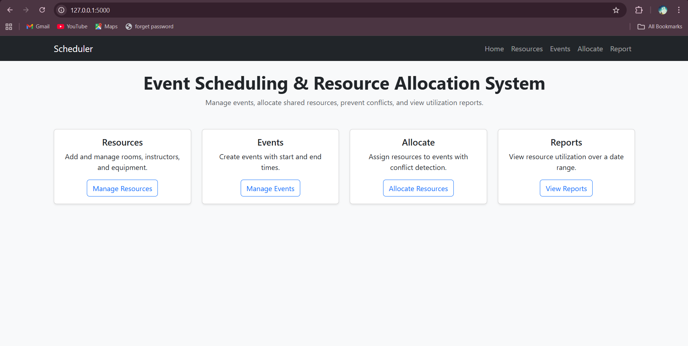
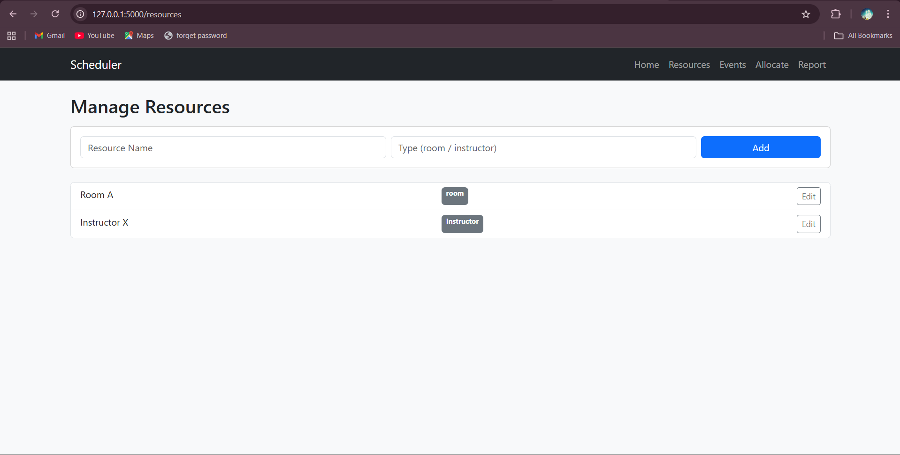
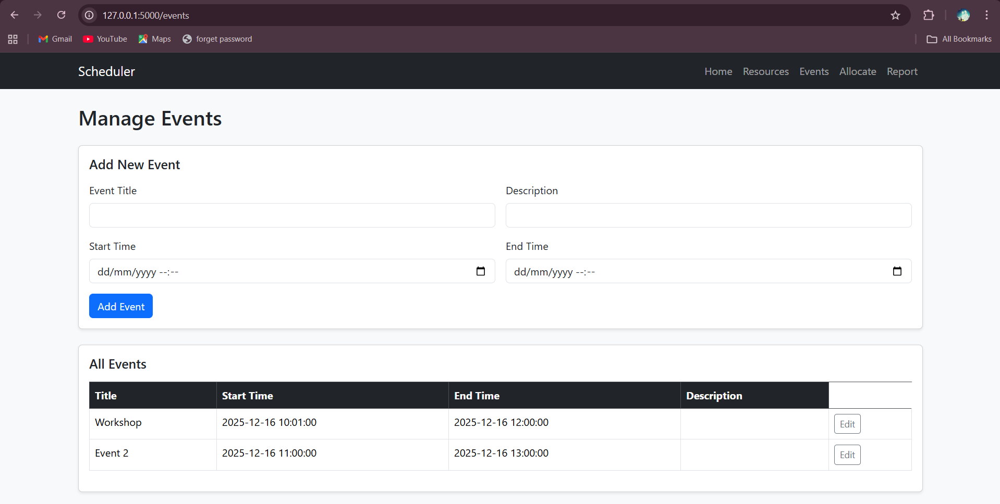
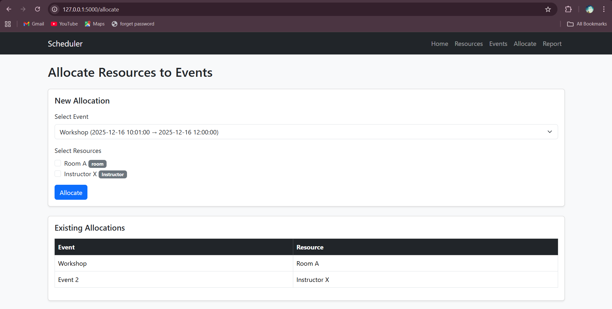
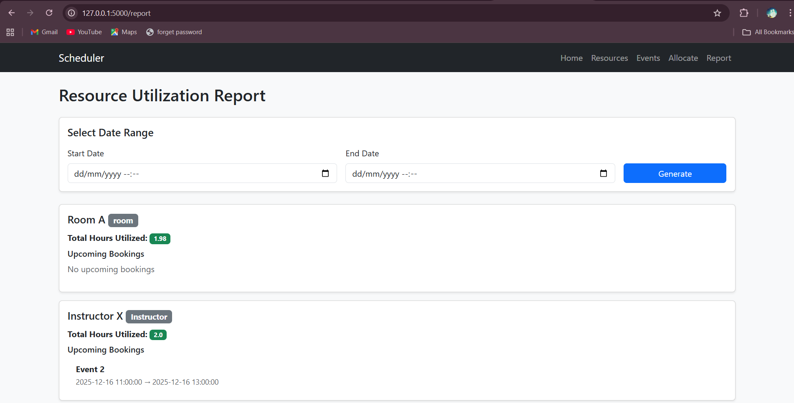

# Event Scheduling and Resource Allocation System

A Flask-based web application developed as part of a campus drive assignment for **Aerele Technologies**.  
This system allows users to manage events and shared resources, allocate resources to events, detect conflicts, and generate utilization reports.

---

## 🚀 Features

###  Event Management
- Add, edit, and view events
- Each event has a title, description, start time, and end time
- Validation to ensure start time is before end time

###  Resource Management
- Add, edit, and view resources
- Resources can be rooms, instructors, or equipment

###  Resource Allocation
- Allocate one or more resources to an event
- Allocation is handled using `event_id` and `resource_id`
- Many-to-many relationship between events and resources

###  Conflict Detection
- Prevents double booking of resources
- Detects time overlap conflicts
- Displays a dedicated conflict detection view

###  Resource Utilization Report
- Generate reports for a given date range
- Shows total hours each resource is utilized
- Displays upcoming bookings per resource

---

## 🛠 Tech Stack

- **Backend:** Python, Flask
- **Database:** SQLite (SQLAlchemy ORM)
- **Frontend:** HTML, Jinja2, Bootstrap 5
- **Version Control:** Git & GitHub

---

## 📂 Project Structure

event_scheduler/
├── app/
│ ├── init.py           # App factory and initialization                                                            
│ ├── models.py         # Database models (Event, Resource, Allocation)                                                                    
│ ├── routes.py         # Application routes and views                                                                                          
│ ├── utils.py          # Conflict detection logic
│ └── templates/        # HTML templates (Bootstrap UI)                                                                
│
├── screenshots/        # UI screenshots for README
├── video/              # Screen-recorded demo video
├── instance/           # SQLite database file
├── requirements.txt    # Project dependencies 
├── run.py              # Application entry point
├── .gitignore          # Git ignore rules
└── README.md           # Project documentation

---

## Screenshots
###  Home / Dashboard


###  Resource Management


###  Event Management


###  Resource Allocation


###  Conflict Detection


###  Resource Utilization Report


---

## 🎥 Demo Video
A complete screen-recorded demonstration of the application, covering:
- Home dashboard
- Resource and event management
- Resource allocation
- Conflict detection
- Resource utilization report

▶ **Demo Video:**  
[Click here to watch the demo](video/demo.mp4)

---

## ▶ How to Run the Application Locally

Follow the steps below to run the application on your local system:

1. Clone the repository:
   ```bash
   git clone https://github.com/Nethraravi/Aerele-event-scheduler-flask.git

2. Navigate to the project directory:
    cd event_scheduler

3. Create and activate a virtual environment:
    python -m venv venv
    venv\Scripts\activate

4. Install the required dependencies:
    pip install -r requirements.txt

5. Run the Flask application:
    python run.py

6. Open your browser and access the application at:
    http://127.0.0.1:5000/
    
---

##  Author

**Nethra**

Campus Drive Assignment  
**Aerele Technologies**

---

## 📌 Notes

- This project was developed as part of a campus recruitment assignment.
- The application follows clean project structure and separation of concerns.
- Conflict detection logic is handled separately for better maintainability.
- Screenshots and a demo video are included as mandatory submission requirements.

